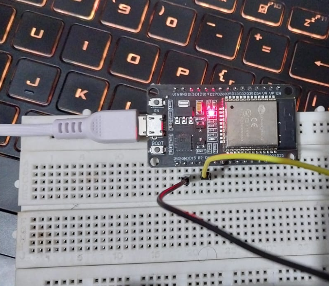
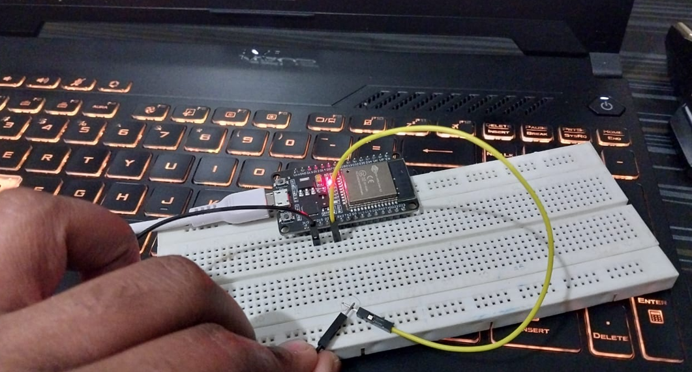

# ESP32_FREERTOS_EVENT_SYSTEM
esp32-freertos-event-system is a clean, event-driven embedded firmware project built using ESP-IDF and FreeRTOS. The project demonstrates best practices for handling GPIO interrupts, ISR-to-task communication, UART logging, and RTOS task design on the ESP32 platform.

## Objective

This project demonstrates a **simple event-driven embedded system** on the ESP32 using **FreeRTOS**.

Key objectives:
- Handle a **GPIO button interrupt** safely using ISR
- Pass events using **FreeRTOS queues**
- Process events in **dedicated tasks**
- Log system activity through **UART**
- Trigger **I2C actions** based on button and timer events
- Avoid polling and tight loops

---

## High-Level System Flow

BUTTON PRESS (GPIO)
        │
        ▼
  GPIO INTERRUPT (ISR)
        │
        ▼
  GPIO EVENT QUEUE
        │
        ▼
     GPIO TASK
        │
        ├── Sends message → UART QUEUE → UART TASK → Serial Output
        │
        └── Sends event → I2C EVENT QUEUE → I2C TASK
                                      │
                                      ├── Button-based I2C action
                                      └── Timer-based I2C action

FREE RTOS TIMER (1s)
        │
        ▼
  I2C EVENT QUEUE
        │
        ▼
     I2C TASK

1. **app_main()**
   - Creates all queues (GPIO, UART, I2C)
   - Initializes drivers (GPIO, UART, I2C)
   - Creates FreeRTOS tasks

2. **GPIO Interrupt**
   - Fires when button is pressed
   - ISR sends a small event to GPIO queue

3. **GPIO Task**
   - Receives button event
   - Sends:
     - Log message → UART queue
     - Event → I2C queue

4. **UART Task**
   - Receives messages
   - Prints them on serial monitor

5. **I2C Task**
   - Reacts to:
     - Button press events
     - Periodic timer events
   - Simulates I2C communication behavior

---

## Project Structure

├── app_main.c          // Entry point
├── app_config.h        // Central configuration

├── gpio_driver.c       // GPIO init + ISR
├── gpio_task.c         // GPIO event handling

├── uart_driver.c       // UART init
├── uart_task.c         // UART logging task

├── i2c_driver.c        // I2C init + timer
├── i2c_task.c          // I2C event handling

---

## How to Build, Flash, and Run

### Prerequisites
- ESP-IDF installed
- ESP32 board connected via USB

### Build

idf.py build
idf.py flash monitor

---

## Expected output 

On boot time: 

I (342) MAIN: ENTRY POINT OF ESP-32 application
I (352) UART_DRIVER: UART driver init successful
I (352) I2C: I2C master initialized

On button press:

Button press event received
I (xxxx) I2C: I2C TASK: Button pressed event received

Periodic I2C activity 

I (xxxx) I2C: I2C TASK: Timer event received

